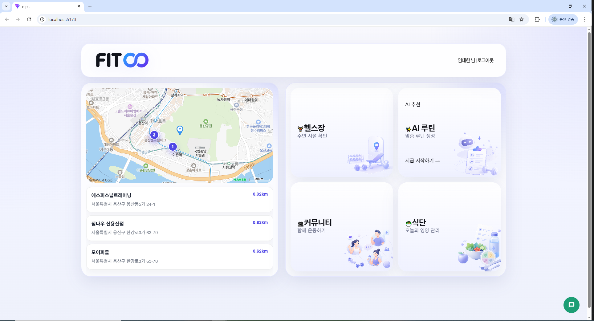
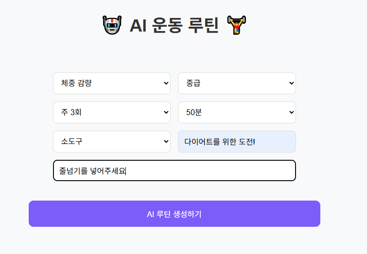
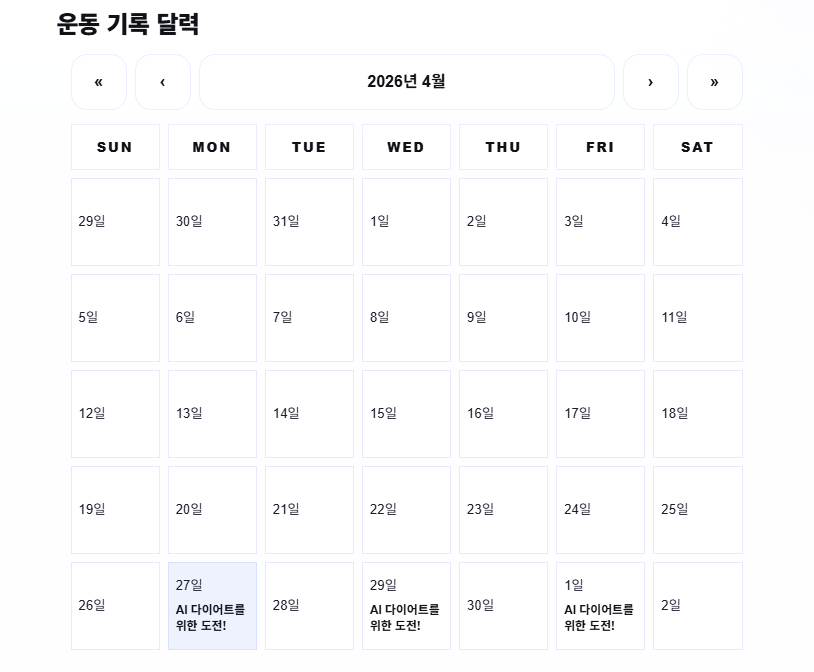

# RE:FIT

## 프로젝트 소개

RE:FIT은 운동을 처음 시작하거나 꾸준히 관리하고 싶은 사용자를 위한 피트니스 관리 서비스입니다.

사용자는 주변 헬스장을 확인하고, AI를 통해 개인 조건에 맞는 운동 루틴과 식단을 생성할 수 있습니다. 생성한 루틴은 저장 후 목록과 상세 페이지에서 확인할 수 있으며, 캘린더 화면에서 날짜별 운동 일정으로 확인할 수 있습니다.

## 팀원

| 이름   | 담당                                                                                                                                                                      |
| ------ | ------------------------------------------------------------------------------------------------------------------------------------------------------------------------- |
| 윤승진 | 프로젝트 구조/역할 분담 정리<br>커뮤니티 CRUD 구현<br>게시판 페이지네이션 처리<br>AI 식단 추천 구현<br>Ollama 오류 해결<br>라우터 구조 문서화<br>발표/문서화 자료 정리    |
| 이가인 | 헬스장 목록/필터 구현<br>공공데이터/CSV 처리<br>무한 스크롤/가상화 최적화<br>검색/정렬 성능 개선<br>찜하기/이벤트 UI 구현<br>헬스장 상세 페이지 개선<br>AI 루틴 영상 연결 |
| 임대한 | 라우팅/페이지 이동 구현<br>로그인/회원가입 구현<br>보호 라우트 처리<br>네이버 지도 API 연동<br>Ollama 루틴 생성 구현<br>루틴 캘린더 자동 연동<br>Axios/광고 API 연동      |

## 개인 작업 기록

| 이름   | Notion                                                                                   |
| ------ | ---------------------------------------------------------------------------------------- |
| 윤승진 | [개인 Notion](https://www.notion.so/RE-FIT-342432fa26f580bfa07ec963b3733ad7)             |
| 이가인 | [개인 Notion](https://www.notion.so/34f442703af480e4be01c14a1c94c145?source=copy_link)   |
| 임대한 | [개인 Notion](https://www.notion.so/1-34f242f3afdb80e5b7dce64b1ef117d6?source=copy_link) |

## 주요 기능

| 기능                | 구현 내용                                                                                                            | 적용 기술 / 코드                                                                    |
| ------------------- | -------------------------------------------------------------------------------------------------------------------- | ----------------------------------------------------------------------------------- |
| 회원가입 / 로그인   | 이름과 비밀번호 기반 회원가입, 로그인, 로그아웃 기능을 구현했습니다. 로그인 상태는 새로고침 후에도 유지됩니다.       | `AuthContext`, `authApi`, `localStorage`, `ProtectedRoute`                          |
| SPA 라우팅          | 페이지 새로고침 없이 홈, 로그인, 회원가입, 헬스장, AI 루틴, 캘린더, 식단, 커뮤니티, 마이페이지로 이동할 수 있습니다. | `React Router`, `BrowserRouter`, `Routes`, `Route`, `Outlet`, `Navigate`            |
| 헬스장 목록 조회    | CSV 파일의 헬스장 데이터를 불러와 목록으로 출력하고, 검색 및 필터 기능을 제공합니다.                                 | `GymListPage`, `GymListFound`, `fetch`, `Papa.parse`                                |
| 헬스장 상세 조회    | 선택한 헬스장의 상세 정보, 이벤트 정보, 상담 신청 모달을 확인할 수 있습니다.                                         | `GymDetail`, `GymInquiryModal`, `GymPromotionCard`                                  |
| 헬스장 즐겨찾기     | 사용자가 관심 있는 헬스장을 즐겨찾기로 저장하고 다시 확인할 수 있습니다.                                             | `useGymFavorites`, `localStorage`                                                   |
| 네이버 지도         | 네이버 지도 API를 이용해 지도 화면을 표시하고, 선택한 위치 기준 주변 헬스장을 확인할 수 있습니다.                    | `NaverMap`, `loadNaverMapSdk`, `useNearbyGyms`, `locationStorage`                   |
| AI 루틴 생성        | 목표, 난이도, 운동 빈도, 운동 시간, 장비 정보를 입력하면 Ollama API를 통해 운동 루틴을 생성합니다.                   | `RoutineForm`, `useAiRoutine`, `requestRoutinePlan`, `ollamaClient.post`            |
| AI 루틴 저장 / 삭제 | 생성된 루틴을 Redux state와 localStorage에 저장하고, 목록에서 조회하거나 삭제할 수 있습니다.                         | `routineSlice`, `addRoutine`, `deleteRoutine`, `useSelector`                        |
| 루틴 캘린더 연동    | 저장된 루틴을 날짜별 운동 일정으로 변환해 캘린더에 표시하고, 클릭 시 상세 내용을 모달로 확인할 수 있습니다.          | `CalendarView`, `buildRoutineCalendarMap`, `RoutineCalendarModal`, `RoutineContent` |
| AI 식단 추천        | 목표와 보유 재료를 입력하면 AI가 식단을 추천하고, 추천 결과를 저장하거나 삭제할 수 있습니다.                         | `DietListPage`, `fetch`, `Ollama`, `localStorage`                                   |
| 커뮤니티 게시판     | 게시글 작성, 조회, 수정, 삭제, 좋아요, 페이지네이션 기능을 제공합니다.                                               | `CommunityListPage`, `localStorage`                                                 |
| 챗봇                | 운동 관련 질문을 입력하면 백엔드 API를 통해 답변을 받을 수 있습니다.                                                 | `FitBot`, `fetch`, `chatbot_backend.py`                                             |
| 코드 스플리팅       | 주요 페이지를 lazy import로 분리하고 Suspense로 로딩 화면을 처리했습니다.                                            | `React.lazy`, `Suspense`, `Loading`                                                 |

## 기술 스택

| 구분             | 기술                                        |
| ---------------- | ------------------------------------------- |
| Frontend         | React, Vite                                 |
| Routing          | React Router                                |
| State Management | Redux Toolkit, React Redux, Context API     |
| API              | Axios, Fetch API, Ollama API, Naver Map API |
| Data             | localStorage, CSV, PapaParse                |
| UI / Library     | React Calendar, React Window                |
| Tooling          | ESLint, Vite                                |

## 사용 라이브러리

```json
{
  "@reduxjs/toolkit": "^2.11.2",
  "@types/navermaps": "^3.9.1",
  "axios": "^1.15.2",
  "papaparse": "^5.5.3",
  "react": "^19.2.5",
  "react-calendar": "^6.0.1",
  "react-dom": "^19.2.5",
  "react-redux": "^9.2.0",
  "react-router-dom": "^7.14.1",
  "react-window": "^2.2.7",
  "redux": "^5.0.1"
}
```

## 실행 방법

### 1. 패키지 설치

```bash
npm install
```

### 2. 환경 변수 설정

프로젝트 루트에 `.env` 파일을 만들고 아래 값을 설정합니다.

```env
VITE_NAVER_MAP_CLIENT_ID=네이버_지도_CLIENT_ID
VITE_OLLAMA_BASE_URL=http://localhost:11434
VITE_OLLAMA_MODEL=llama3.2
VITE_API_URL=http://localhost:8000/api/chat
```

### 3. 개발 서버 실행

```bash
npm run dev
```

### 4. 빌드

```bash
npm run build
```

### 홈페이지 흐름


### AI 루틴 생성 흐름


### AI 루틴 저장 및 캘린더 연동 흐름


### 헬스장 목록 조회 흐름


### 지도 및 주변 헬스장 흐름


### 로그인 로직 흐름


### 커뮤니티 흐름


### 홈 화면



### 헬스장 리스트


### AI 루틴 생성



### 루틴 캘린더



### 식단 및 챗봇


## 성능 및 구조 개선

- `React.lazy`와 `Suspense`를 사용해 페이지 단위 코드 스플리팅을 적용했습니다.
- 루틴 캘린더 계산에는 `useMemo`를 사용해 루틴 목록이 바뀔 때만 날짜별 데이터를 다시 계산하도록 했습니다.
- 헬스장 목록과 즐겨찾기 상태는 역할별 hook과 component로 분리했습니다.
- 반복해서 사용하는 루틴 저장 데이터는 Redux state와 localStorage를 함께 사용해 새로고침 후에도 유지되도록 했습니다.
- CSV 데이터 파싱은 PapaParse를 사용해 직접 문자열을 다루는 방식을 줄였습니다.

## 환경 변수

| 이름                       | 설명                              |
| -------------------------- | --------------------------------- |
| `VITE_NAVER_MAP_CLIENT_ID` | 네이버 지도 API Client ID         |
| `VITE_OLLAMA_BASE_URL`     | Ollama API 기본 주소              |
| `VITE_OLLAMA_MODEL`        | AI 루틴 생성에 사용할 Ollama 모델 |
| `VITE_API_URL`             | FitBot 챗봇 백엔드 API 주소       |
